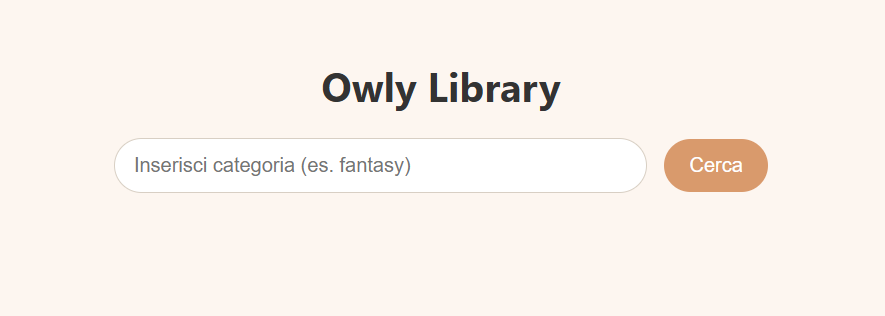

#  Owly Library

Applicazione JavaScript che utilizza le API di [Open Library](https://openlibrary.org/)  
per cercare libri per categoria e visualizzare descrizioni interattive.

  

##  Provalo online
👉 

## Funzionalità
- Ricerca libri per categoria (es. *fantasy*, *history*, *science*)
- Visualizzazione titoli e autori
- Descrizione completa tramite modale
- Interfaccia responsive e accessibile

## Tecnologie utilizzate
- HTML5  
- CSS3  
- JavaScript (ES6+)  
- Fetch API (integrazione con Open Library)

## 🧩 Struttura del progetto
owly-library/
│
├── index.html
├── css/style.css
├── js/api.js
├── js/main.js
├──
└── README.md

## 👨‍💻 Autore
**Adele R**  
